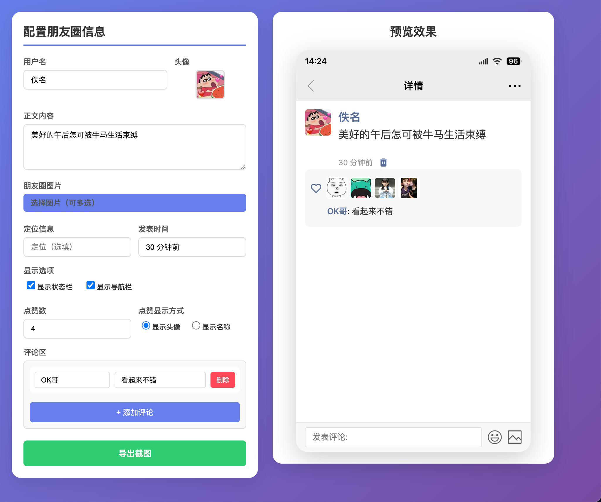

# 微信朋友圈截图生成器

一个简单易用的微信朋友圈截图生成工具，可以自定义各种朋友圈元素，生成逼真的朋友圈截图。

  

## ✨ 功能特性

### 🎨 用户信息配置
- **自定义用户名** - 支持任意中英文字符
- **头像上传** - 点击头像区域即可上传，支持JPG/PNG格式
- **自动随机头像** - 内置5000+默认头像随机选择

### 📝 内容编辑
- **朋友圈正文** - 支持多行文本，自动换行
- **图片上传** - 支持1-9张图片，自动适配布局
- **定位信息** - 可选添加地理位置显示
- **时间设置** - 自定义发表时间格式

### 💬 互动功能
- **点赞功能** - 支持0-100个点赞，自动生成随机头像
- **两种显示模式** - 点赞可显示为头像或名称列表
- **评论系统** - 支持多条评论，每条包含评论者和内容
- **实时预览** - 所有修改即时反映在预览中

### 📸 截图导出
- **高清导出** - 2倍分辨率PNG格式图片
- **智能裁剪** - 自动适配内容高度，无多余空白
- **本地处理** - 无需网络，保护隐私

## 🚀 快速开始

### 方法一：直接打开（推荐）
1. 用现代浏览器（Chrome、Firefox、Edge等）打开 `index.html`
2. 在左侧配置面板填写信息
3. 右侧实时预览效果
4. 点击"导出截图"保存

### 方法二：本地服务器
如遇到CORS问题，可启动本地服务器：
```bash
# Python 3
python -m http.server 8000

# Node.js
npx http-server -p 8000 --cors

# 然后访问
http://localhost:8000
```

## 📱 预览效果

### 配置界面及生成效果图


#### 功能特性展示
- ✅ **真实模拟** - 完美还原微信朋友圈界面
- ✅ **动态高度** - 根据内容自动适配
- ✅ **多图布局** - 智能适配1-9张图片
- ✅ **互动元素** - 点赞、评论、定位等完整功能
- ✅ **高清导出** - 2倍分辨率PNG图片

## 🛠 技术栈

- **HTML5** - 语义化标签，响应式布局
- **CSS3** - Flexbox布局，动画效果
- **JavaScript ES6+** - 模块化开发，防抖优化
- **html2canvas** - 高质量DOM转图片
- **无后端依赖** - 纯前端实现

## 📱 功能说明

### 📸 图片布局规则
- **1张图片**: 60%宽度，最大高度300px
- **2张图片**: 各占50%，高度120px
- **3-9张图片**: 九宫格布局，高度90px

### 🎯 点赞显示逻辑
- **头像模式**: 37x37px圆形头像，自动换行
- **名称模式**: "张三、李四、王五等10人"格式
- **智能间距**: 根据显示模式自动调整对齐

### 💬 评论系统
- **多条支持**: 可添加无限条评论
- **居中显示**: 评论文字水平居中对齐
- **智能隐藏**: 无评论时不显示空白区域

## 🔧 自定义配置

### 点赞数据
```javascript
// 可修改默认点赞名称列表
const likeNames = ['张三', '李四', '王五', ...];

// 调整点赞数范围
document.getElementById('likeCount').min = 0;
document.getElementById('likeCount').max = 100;
```

### 默认头像
头像文件位置：`avatar/a1.jpg` - `avatar/a5000.jpg`

## 🌟 项目特色

1. **零配置使用** - 打开即用，无需安装
2. **实时预览** - 所见即所得，操作流畅
3. **高度优化** - 动态高度适配，导出完美
4. **隐私保护** - 完全本地处理，数据不上传
5. **响应式设计** - 适配各种屏幕尺寸

## ⚠️ 注意事项

- **浏览器兼容性**: 推荐Chrome 80+、Firefox 75+、Edge 80+
- **图片格式**: 支持JPG、PNG、GIF、WebP等常见格式
- **文件大小**: 单张图片建议不超过5MB
- **CORS问题**: 如遇本地图片加载失败，请使用本地服务器方案
- **导出格式**: PNG格式，支持透明背景

## 🤝 贡献指南

欢迎提交Issue和Pull Request！

### 开发环境
1. 克隆仓库：`git clone [仓库地址]`
2. 直接打开`index.html`即可开始开发
3. 修改代码后刷新页面查看效果

### 提交规范
- Bug修复: `fix: 修复评论无法触发预览的问题`
- 新功能: `feat: 添加表情包支持`
- 文档: `docs: 更新README说明`

## 📄 许可证

本项目采用 [MIT License](LICENSE) 开源协议。

## 🙏 致谢

- [html2canvas](https://html2canvas.hertzen.com/) - 强大的DOM转图片库
- [现代浏览器](https://www.mozilla.org/firefox/new/) - 提供强大的Web API支持

---

**⭐ 如果这个项目对你有帮助，请给个Star支持一下！**

## 📞 联系方式

- 📧 邮箱: [305694695@qq.com]
- 🐛 问题反馈: [GitHub Issues](https://github.com/tstin30/WechatMomentsScreenShot/issues)

---

<div align="center">
  <p>Made with ❤️ by AI Assistant</p>
  <p>仅供学习娱乐使用，请勿用于商业或非法用途</p>
</div>